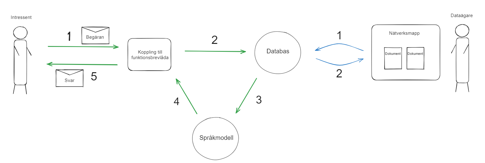

#  Effektiv Administration

##  Projektbeskrivning
Utveckla en MVP för en informationshanteringsapplikation avsedd för svenska myndigheter, med syftet att nyttja kraften hos språkmodeller för hantering av ostrukturerad data. Applikationen är intuitivt konstruerad för enkel uppladdning och hämtning av sådan data, och är skräddarsydd för en bred implementering över diverse organisatoriska miljöer.

##  Innehållsförteckning
-  [Kravspecifikation](#kravspecifikation)
-  [Installation](#install_and_run)
-  [Användning](#use_project)
-  [Arkitektur](#arkitektur)
-  [Utvecklare](#acknowledgements)
-  [Bidra till projektet](#contribute)

 ##  Kravspecifikation <a  name="kravspecifikation"></a>
Systemet ska omvandla e-postmeddelanden skrivna i naturligt språk till sökbara nyckelord/fraser för att söka i tillhörande dokumentation.

###  Svarstid
Beskrivning: Efter att ett mejl har skickats av en användare ska svaret genereras och returneras inom 30 sekunder.

###  Källhänvisningar
Beskrivning: Svaret ska innehålla klickbara länkar till de källor som användes för att generera svaret, vilket möjliggör för användaren att granska originalmaterialet.

###  Minimal hallucination
Beskrivning: Systemet ska endast svara med exakt dokumentationsinnehåll och undvika missvisande svar. Vid ingen träff bör svaret vara "Materialet kunde inte hittas inom referensmaterialet."

###  On-Premise Lösning
Beskrivning: Systemet ska installeras och köras internt (on-premise). Ingen användardata får överföras utanför systemets gränser.

###  Modulär Arkitektur
Beskrivning: Systemets komponenter ska vara fristående och kommunicera via API-anrop.

###  Naturligt Språk
Beskrivning: Användare ska kunna interagera med systemet via e-post i naturligt språk, även för större textmassor.

###  Dokumentuppladdning (Utan förberedelser)
Beskrivning: Dataägare ska ha möjlighet att ladda upp Word-dokument direkt, utan förhandsredigering eller annan bearbetning.

###  Dokumentuppladdning (Drag och Släpp)
Beskrivning: Dataägare ska kunna dra och släppa dokument i en säkrad nätverksmapp. Endast behöriga dataägare ska ha tillgång.

###  Säkerhet och Skalbarhet
Beskrivning: Med tanke på målgruppen (myndigheter) är hög säkerhet och systemets förmåga att växa (skalbarhet) primära fokusområden.

##  Installation av projektet <a  name="install_and_run"></a>

Denna installationsguide är anpassad för Ubuntu 22.04

###  Installera moduler

1.Klona projektet från github
2.Öppna sökvägen i terminalen
```bash
cd Effektiv-Administration
```
3.Installera de moduler som krävs för att köra projektet
```bash
pip install -r requirements.txt
```

[Dokumentation för ChromaDB](https://docs.trychroma.com/)

##  Användande <a  name="use_project"></a>

### Snabbstart

Starta alla moduler

```bash
./start_everything.bash --watcher --mail --model
```

Starta moduler separat

```bash
./start_everything.bash --watcher
./start_everything.bash --model
./start_everything.bash --mail
```

### API

Starta API:et

Detta kommando körs från root-mappen

```bash
python3 src/server_model.py
```

#### POST /prompt
Skicka en prompt och få ett svar tillbaka.

**Parametrar**

|          Namn | Obligatorisk |  Typ   | Beskrivning                                                                                                                                                           |
| -------------:|:--------:|:-------:| --------------------------------------------------------------------------------------------------------------------------------------------------------------------- |
|     `prompt` | ja | string  | Ett textstycke med en fråga eller ett meddelande                                                                      |

**Response**

Svar som ges när en prompt inte har skickats med

```
{
    "error": "no prompt received!"
}
```


Exempel på svar då korrekt formaterad prompt har skickats med

```
{
    "answer": "Hej! Här är ett svar på din fråga. Budgeten är 2000 kr" // Svar på frågan/meddelandet
    "prompt": "Vad är budgeten för projekt helhälsa?" // Prompt som skickats
    "doc_names": ["projekt_helhalsa.docx", "budget_helhalsa.docx"] // Lista över dokument som använts för att besvara frågan
}
```

### Funktionsbrevlåda

Starta funktionsbrevlådan

```bash
python3 src/server_mail.py
```

I nuläget används Googles API för att kunna ta emot och skicka mail från en gmail-adress. Filerna src/credentials.json och src/token.json krävs för att kunna komma åt api:et. 

Endast mail med rubriken "fråga" läses in.


##  Arkitektur<a  name="arkitektur"></a>


###  Databas
Vektordatabasen som används i detta projekt är [Chroma DB](https://www.trychroma.com/)
1. Dokumenten laddas in och delas in i mindre chunks
2. Alla chunks lagras i vektordatabasen. Chroma DB använder Sentence Transformers all-MiniLM-L6-v2 för att skapa embeddings som standard.
3. En watcher kollar om det sker några ändringar i dokumentmappen och uppdaterar databasen.

### Språkmodell
1. Relevant information hämtas från Chroma DB med hjälp av användarinput.
2. Llama 2-13b genererar ett svar med hjälp av användarinput och hämtad information från databasen.

##  Utvecklare <a  name="acknowledgements"></a>
Detta projekt möjliggjordes tack vare de följande utvecklarna:
-  [Niels Houben](https://github.com/NielsHouben)
-  [Sofia Nguyen](https://github.com/sofianguyenAI)
-  [Felix Folkebrant](https://github.com/FelixFolkebrantAIS)
-  [Gustav Jakobsson](https://github.com/gusjak251)